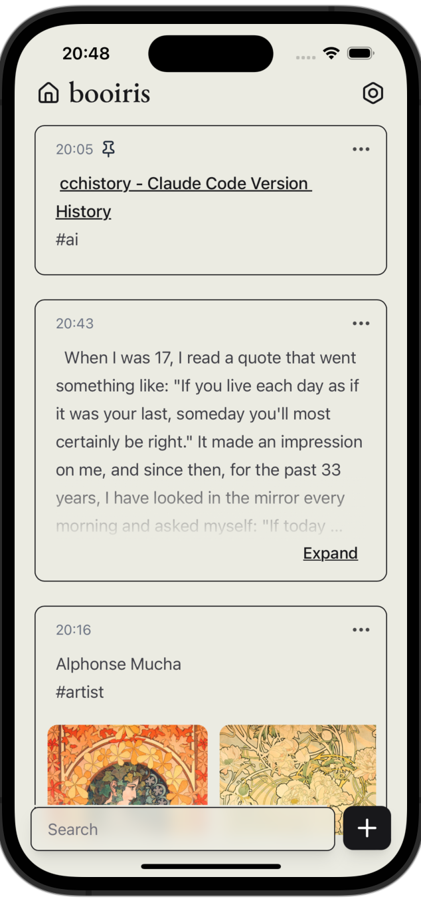

# MMemos

A third-party Memos mobile client built with Tauri 2.0.

*To use this app, you must have a self-hosted [memos](https://github.com/usememos/memos) server set up and running.*

**Note: Current MMemos version supports Memos 0.24. Memos update may introduce breaking API changes.**

## Screenshots

## Installation

MMemos is available on App Store for free. You can also build this app with Xcode and run on your devices. iOS 14 or higher is required.

## Features

- Sync with your own memos server
- Offline reading support
- Basic Markdown and image support
- Group memos with tags
- Pin and search memos
- Full privacy protection, no data collection

## Tech Stack

- **Backend**: Tauri 2.0 (Rust)
- **Frontend**: Vue 3 + TypeScript + Vite
- **State Management**: Pinia
- **Styling**: Tailwind CSS + Shadcn UI
- **Package Manager**: pnpm

## Roadmap

- [ ] Support Android
- [ ] Retrospect memo 
- [ ] Latex support
- [ ] File(pdf, audio etc.) attachment support
- [ ] Image search and recognition
- [ ] AI-powered link summarization
- [ ] Offline editing support
- [ ] Performance optimization

## Acknowledgments

Thanks to:

- [memos](https://github.com/usememos/memos)
- [MMemos-iOS](https://github.com/mudkipme/MoeMemos)

## License

The iOS version of MMemos is under [GPL-3.0](LICENSE).

While the open source license doesn't prevent anyone rename and repackage this app to distribute, it violates App Store Review Guidelines 4.1 to do so. It's welcome to build apps based off of the code in this repository and make it meaningfully different.